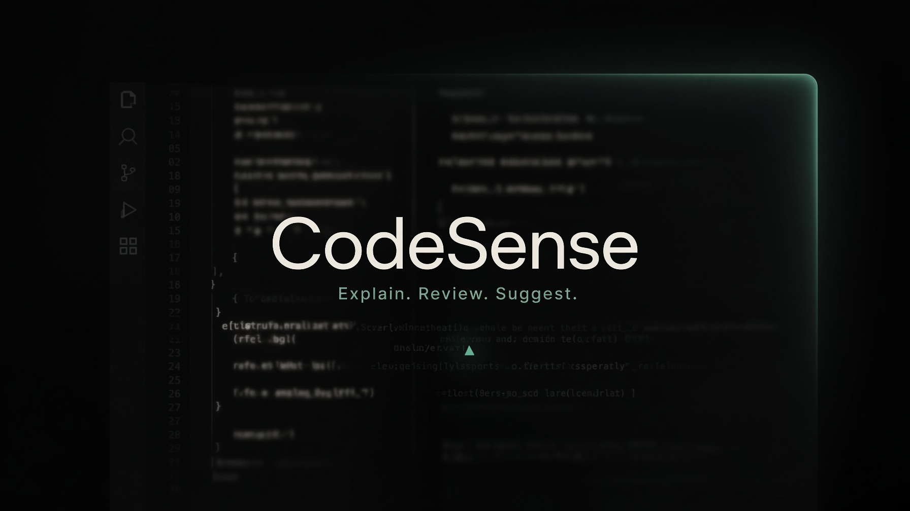

<p align="center">
  
</p>

# CodeSense

**Real-time code explanation, review, and completion — inside your editor.**

CodeSense delivers fast, focused LLM responses as you select, save, or pause — no multi-step agents, no RAG, just three modes over a unified SSE gateway.

---

## Features

| Mode         | Trigger                        | Output                                 |
|--------------|-------------------------------|----------------------------------------|
| **Explain**  | Selection or manual            | Streaming natural-language explanation |
| **Review**   | Save (`Ctrl/Cmd+S`) or manual  | Structured feedback panel              |
| **Suggest**  | Idle (debounced)               | Inline ghost-text completion           |

---

## Quick Start

**Requirements:** Node.js 18+ (uses built-in `http`/`fs`, no `npm install` needed).

```bash
cd codesense-app
node server.cjs
# or: ./start.sh
```

Then open **[http://localhost:8080](http://localhost:8080)** in your browser.

---

### API Keys (Optional)

By default, the gateway runs in **demo mode**, streaming offline synthetic responses so the UI is fully usable.

To use real providers, export your API keys as environment variables:

```bash
export ANTHROPIC_API_KEY=sk-ant-…     # preferred (Claude Haiku-class)
# or
export XAI_API_KEY=xai-…
export OPENAI_API_KEY=sk-…            # fallback

export GEMINI_API_KEY=AQ-…

# Optional model overrides:
export ANTHROPIC_MODEL=claude-3-5-haiku-latest
export XAI_MODEL=grok-3-mini
export OPENAI_MODEL=gpt-4o-mini
export GEMINI_MODEL=gemini-3.6-flash

node server.cjs
```

---

### Bring Your Own Key (Web UI)

- Open **Settings** in the app and paste your API key in **API key (optional)**.
- Press **Save key**. Leave **Provider** on *Auto-detect from key* and CodeSense will choose by key prefix:

| Key prefix           | Provider                   |
|----------------------|---------------------------|
| `sk-ant-…`           | Anthropic Claude           |
| `xai-…`              | xAI Grok                  |
| `AIza…` / `AQ…`      | Google Gemini             |
| `sk-…` or other      | OpenAI / OpenAI-compatible |

- The key is kept in your browser's `localStorage` and sent per request as the `X-Codesense-Key` header (plus `X-Codesense-Provider` if set).
- Your key is never logged or written to disk by the gateway. In-app key overrides any server env variable.
- The signal in the header shows **demo** (amber) without a key, turns **Got API Key** (green) when set, and goes back to **demo** if you clear the key.

---

## Try CodeSense

1. **Explain** — select code in the Monaco editor, or click **Explain**
2. **Review** — press `Ctrl/Cmd+S` or click **Review**
3. **Suggest** — pause while typing; accept ghost text with **Tab**
4. Switch among languages: TypeScript, JavaScript, Python, Go, Rust, Java — and load a sample
5. Use **Settings** to toggle features, adjust debounce (100–800 ms), or paste your own provider key

---

## Architecture

```text
┌──────────────────────┐     ┌───────────────────────────┐
│  Web (Monaco Editor) │     │  VS Code Extension        │
│  public/app.js       │     │  vscode-extension/        │
└──────────┬───────────┘     └──────────┬────────────────┘
           │ snippet + mode + cursor    │
           └─────────────┬──────────────┘
                         ▼
              ┌────────────────────┐
              │     Gateway        │
              │ POST /api/codesense│
              │ • prompt router    │
              │ • rate limit       │
              │ • token budget     │
              └─────────┬──────────┘
                        ▼
              ┌────────────────────┐
              │   LLM Providers    │
              │ Anthropic / xAI /  │
              │ OpenAI / Gemini /  │
              │ demo (streaming)   │
              └────────────────────┘
```

---

## API Reference

### Health Check

```http
GET /api/health
```

Response example:
```json
{
  "ok": true,
  "provider": "demo",
  "maxInputTokens": 800
}
```

---

### Main Endpoint (`/api/codesense`)

```http
POST /api/codesense
Content-Type: application/json

{
  "mode": "explain" | "review" | "suggest",
  "language": "typescript",
  "snippet": "function add(a: number, b: number) { return a + b; }",
  "cursorLine": 12,
  "cursorCol": 4
}
```

**Response:** `text/event-stream`

Example:
```
data: {"delta":"This function"}
data: {"delta":" adds two numbers…"}
data: [DONE]
```

**Error Codes:**

| Code                   | Meaning                                      |
|------------------------|----------------------------------------------|
| `INVALID_MODE`         | Invalid `mode` value                         |
| `EMPTY_SNIPPET`        | Missing or blank `snippet`                   |
| `RATE_LIMITED`         | >30 requests/min per client IP               |
| `TOKEN_LIMIT_EXCEEDED` | Snippet over ~800 token budget               |
| `PROVIDER_TIMEOUT`     | Upstream LLM failure                         |

---

## Project Structure

```text
codesense-app/
├── server.cjs              # HTTP server + SSE gateway (port 8080)
├── start.sh                # Convenience launcher
├── lib/
│   ├── prompts.mjs         # System + mode templates, token counting
│   ├── rateLimit.mjs       # Token-bucket: 30 req/min per client
│   └── providers.mjs       # Anthropic / xAI / OpenAI / demo streams
├── public/
│   ├── index.html          # App shell
│   ├── styles.css          # Editor theming
│   └── app.js              # Monaco + SSE client + settings
└── vscode-extension/       # Optional VS Code extension
    ├── package.json
    ├── tsconfig.json
    └── src/extension.ts
```

---

## VS Code Extension

Works with the **same gateway**.

```bash
cd vscode-extension
npm install
npm run compile
```

In VS Code: use **Developer: Install Extension from Location…** then select this folder.

| Setting                   | Default                 | Description                    |
|---------------------------|-------------------------|--------------------------------|
| `codesense.gatewayUrl`    | `http://127.0.0.1:8080` | Gateway base URL               |
| `codesense.debounceMs`    | `300`                   | Debounce for explain/suggest   |
| `codesense.enableExplain` | `true`                  | Explain on selection           |
| `codesense.enableReview`  | `true`                  | Review on save                 |
| `codesense.enableSuggest` | `true`                  | Inline completions             |

**Commands:**  
- `CodeSense: Explain Selection`  
- `CodeSense: Review Document`  
- `CodeSense: Toggle Suggest`

---

## Design Decisions

| Concern            | Choice                        | Reason                                      |
|--------------------|------------------------------|---------------------------------------------|
| Streaming          | SSE over `fetch`              | Simple, real-time LLM streaming             |
| API keys           | Server-side only              | Never exposed to browser                    |
| Debounce           | 300 ms default                | Balances responsiveness & cost              |
| Context window     | ±30 / +10 lines around cursor | Keeps input under ~800 tokens               |
| Default model path | Fast/Cheap (Haiku-class)      | Prioritizes latency for keystroke UX        |
| Ghost text         | Monaco/VS Code native APIs    | No DOM hacks; proper editor UX              |
| Dependencies       | Node built-ins & CDN Monaco   | No `npm install` required for web           |

### Out of Scope (v1)

- Multi-step agent loops/tool execution  
- Persistent conversation memory  
- RAG/codebase indexing  
- Authentication/user accounts  
- Jupyter/notebook support

---

## Configuration Reference

| Env var              | Purpose                        |
|----------------------|--------------------------------|
| `PORT`               | Listen port (default: `8080`)  |
| `ANTHROPIC_API_KEY`  | Primary provider key           |
| `ANTHROPIC_MODEL`    | Override Anthropic model id    |
| `XAI_API_KEY`        | xAI / Grok provider key        |
| `XAI_MODEL`          | Override xAI model id          |
| `OPENAI_API_KEY`     | OpenAI fallback key            |
| `OPENAI_MODEL`       | Override OpenAI model id       |

---

## Contributing

Contributions are welcome! Please fork the repo and submit a pull request.

---

## License

MIT — use it, fork it, ship it.
